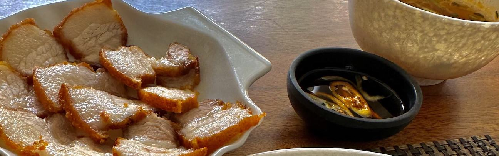
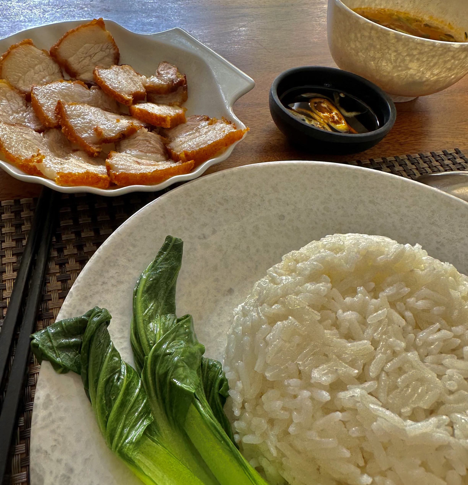

<!--truncate-->

---

Câu chuyện số 1:

Sáng

Câu chuyện số 2:

Hôm nay trên đường đi thì vô tình gặp lại đứa bạn chung trường từng làm chung team cũ. Chào hỏi vài câu rồi đi ăn một mình (3), đúng là thời gian trôi qua nhanh thật, chỉ có mỗi một mình mình là không nhận ra nó trôi nhanh như thế nào thôi 😄.

Câu chuyện số 3:

Món mình thích tại Bush, đây là lý do mình quyết định đi ăn dù đi một mình. Mình rất thích cái độ khô của cơm ở đây. Nhưng hôm nay nó lại nhão quá 🫠. Nhân viên cũng quên phục vụ nước và canh chua thì siêu mặn.

haha y như tâm trạng mình vậy.
