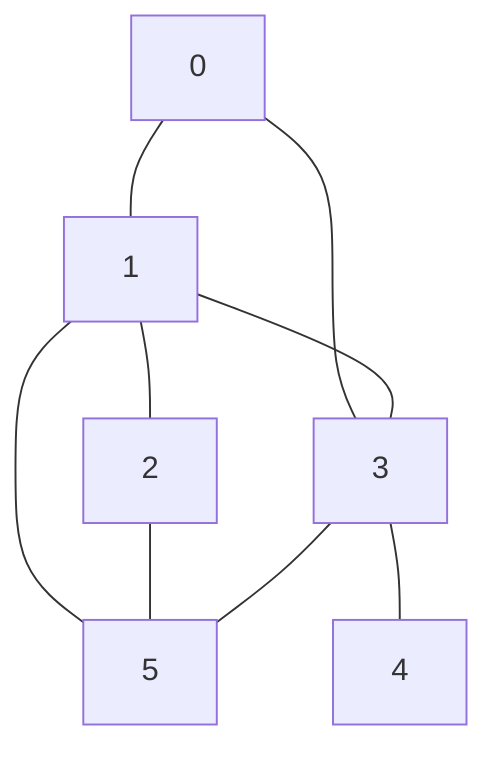

import Tabs from '@theme/Tabs';
import TabItem from '@theme/TabItem';

# BFS & DFS

Xem sơ đồ thị :palm_tree:. Do BFS và DFS là 2 thuật toán duyệt đồ thị.

## BFS (Breathe First Search)

### Xài khi nào?

Tìm kiếm theo chiều rộng. Dùng trên đồ thị **không trọng số** (vô hướng hoặc có hướng).
Nếu có trọng số thì trọng số các đường đi phải giống nhau (do thuật toán chỉ đếm số cạnh đi qua).

### Giới thiệu cơ chế

Tưởng tượng giống như nhỏ giọt dầu xuống, giọt dầu loang ra khắp rộng. Duyệt BFS
sẽ đi tất cả đường đi có thể đi.

TODO: Giả sử với cái hình như này (14:41)

Nó sẽ đi từ đỉnh ra, đỉnh nào gần đỉnh gốc trước thì đi trước. Làm thế nào để biết phải đi đỉnh nào trước
$\rightarrow$ dùng array để lưu lại. Những điểm gần hơn thì mình cần ưu tiên xử lý hơn
$\rightarrow$ xử lý thằng nào lưu trước
$\rightarrow$ FIFO
$\rightarrow$ dùng **queue**.

BFS trả lời được câu hỏi:
- có đường từ u $\rightarrow$ v hay không?
- tìm được đường đi ngắn nhất (nếu tồn tại)

**Độ phức tạp: $O(V + E)$**

*\*V: total of vertices E: total of edges*

### Cách lưu trữ



Có 3 cách:

#### Ma trận kề (Adjacency matrix)

Tạo **ma trận vuông kích thước $V^2$**. Phần tử ô $[i][j]$ đại diện có cạnh giữa node
$i$ và $j$ hay không (0 là không, 1 là có). Đồ thị vô hướng thì đường chéo là 0 hết.

```bash
6 (đỉnh)
0 1 0 1 0 0
1 0 1 1 0 1
0 1 0 0 0 1
1 1 0 0 1 1
0 0 0 1 0 0
0 1 1 1 0 0
```

Cách lưu trữ đơn giản nhưng tốn bộ nhớ. Có những cạnh không tồn tại nhưng vẫn tốn
bộ nhớ để lưu nó. Khả năng truy xuất cũng kém hơn, ví dụ muốn biết node 0 kết nối
với những đỉnh nào thì phải dò hết hàng 0.

#### Danh sách cạnh (Edge list)

**Lưu theo E cạnh**. Ví dụ ở đây có 8 cạnh $\rightarrow$ lưu 8 dòng.

```bash
6 8 <- 6 đỉnh, 8 cạnh
0 1
0 3
1 2
1 3
1 5
2 5
3 4
3 5
```

Cách lưu tiết kiệm bộ nhớ hơn tuy nhiên vẫn chưa giải quyết vấn đề duyệt xem node
đó kề với node nào. Ví dụ tìm 1 kề với cái nào? 1 kề với 0, 2, 3, 5 (ví dụ trên
đã sort đẹp rồi, ví dụ không theo thứ tự đẹp thì vẫn phải duyệt toàn bộ cạnh).

#### Danh sách kề (Adjacency list)

Lưu theo **V đỉnh**. Mỗi đỉnh sẽ có 1 danh sách các đỉnh kề với nó.

```bash
0: 1 3
1: 0 2 3 5
2: 1 5
3: 0 1 4 5
4: 3
5: 1 2 3
```
Có thể thấy nó là cải tiến của adjacency matrix. Loại bỏ đi các số 0 dư thừa (cạnh
không tồn tại). Ngoài ra, cũng trực quan cho biết node nào kề với node nào.

Cách lưu này tiết kiệm bộ nhớ nhất. Cách lưu này cũng giải quyết được vấn đề duyệt.

*\*Note: thứ tự danh sách kề không nhất thiết tăng dần, lưu thứ tự nào cũng được.
Vì các cạnh đều sẽ đi qua.*

### Cài đặt

1. Chuẩn bị dữ liệu:
- Danh sách cạnh kề: `graph`
- Mảng đánh dấu các đỉnh đã xét: `visited`
- Mảng lưu đường đi: `path`. `path[i]` nghĩa là đỉnh trước đỉnh $i$ là đỉnh nào trong đường đi ngắn nhất từ đỉnh gốc đến đỉnh $i$.
- Queue để lưu các đỉnh cần xét: `queue`

2. Khởi tạo dữ liệu:
- `visited` và `path` khởi tạo giá trị ban đầu là 0
- `queue` khởi tạo giá trị ban đầu là đỉnh gốc

3. Duyệt:
- Lấy đỉnh đầu tiên trong `queue` ra (gần đỉnh gốc nhất)
- Duyệt các đỉnh kề với đỉnh đó
- Nếu đỉnh kề chưa được xét thì đánh dấu đã xét và lưu vào `queue`
- Lưu đỉnh đó vào `path` (đỉnh trước đỉnh đó là đỉnh đầu tiên trong `queue`)
- Lặp lại bước 1

Muốn biết đường đi đi như thế nào thì nhìn vào mảng `path`.

<Tabs groupId="stack">
  <TabItem value="py" label="Python">
    ```py
    from queue import Queue
    MAX = 100
    V = None
    E = None
    visited = [False for i in range(MAX)]
    path = [0 for i in range(MAX)]
    graph = [[] for i in range(MAX)]

    def BFS(s):
      for i in range(V):
        visited[i] = False
        path[i] = -1
      q = Queue()
      visited[s] = True
      q.put(s)
      while not q.empty():
        u = q.get()
        for v in graph[u]:
          if not visited[v]:
            visited[v] = True  # đôi khi có thể dùng cái khác đánh dấu mà ko cần visited luôn
            q.put(v) # ví dụ cần lưu thông tin phụ thì thêm vô đây (dùng tuple)
            path[v] = u  # nếu bài toán ko cần tìm đường đi thì có thể bỏ
    ```
  </TabItem>
  <TabItem value="java" label="Java">
    ```java
    import java.util.Scanner;
    import java.util.ArrayList;
    import java.util.LinkedList;
    import java.util.Queue;

    private static void BFS(int s) {
      Queue<Integer> q = new LinkedList<>();
      path = new ArrayList<>();
      visited = new ArrayList<>();
      for (int i = 0; i < V; i++) {
        visited.add(false);
        path.add(-1);
      }
      visited.set(s, true);
      q.add(s);
      while (!q.isEmpty()) {
        int u = q.remove();
        for (int i = 0; i < graph.get(u).size(); i++) {
          int v = graph.get(u).get(i);
          if (!visited.get(v)) {
            visited.set(v, true);
            path.set(v, u);
            q.add(v);
          }
        }
      }
    }
    ```
  </TabItem>
  <TabItem value="cpp" label="C++">
    ```cpp
    #include <iostream>
    #include <vector>
    #include <queue>
    using namespace std;
    #define MAX 100  // tùy bài toán mà thay đổi
    int V, E;
    bool visited[MAX];
    int path[MAX];
    vector<int> graph[MAX];

    void BFS(int s) {
      // Khởi tạo
      for (int i = 0; i < V; i++) {
        visited[i] = false;  // các đỉnh chưa được ghé thăm
        path[i] = -1;  //  và chưa có đường đi
      }

      queue<int> q;
      visited[s] = true; // mặc định luôn có đường đi từ đỉnh gốc đến chính nó
      q.push(s);  // lưu vào hàng đợi

      while (!q.empty()) {
        int u = q.front();  // lấy đỉnh đầu tiên queue ra (gần đỉnh gốc nhất)
        q.pop();

        // duyệt các đỉnh kề với đỉnh u
        for (int i = 0; i < graph[u].size(); i++) {
          int v = graph[u][i];  // lấy v là đỉnh kề với u
          // nếu trước đây chưa có đường đi tới đỉnh v
          // (nếu trước đây đã có đường đi tới đỉnh v thì đó là đường đi tốt hơn rồi)
          if (!visited[v]) {
            visited[v] = true;
            q.push(v);
            path[v] = u;  // cập nhật đường đi: muốn tới v thì phải tới u trước
          }
        }
      }
    }
    ```
  </TabItem>
</Tabs>


### Thêm

#### Chứng minh đồ thị không liên thông

Khi 2 đỉnh cần tìm không có đường đi tới được nhau (ví dụ 2 đồ thị không liên thông).

#### Làm sao chứng minh được đường đi đó là ngắn nhất?

#### Đọc input

<Tabs groupId="stack">
  <TabItem value="py" label="Python">
    ```py
    if __name__ == "__main__":
      V, E = map(int, input().split())
      for i in range(E):
        u, v = map(int, input().split())
        graph[u].append(v)
        graph[v].append(u)
      s = 0
      f = 5
      BFS(s)
      printPath(s, f)
    ```
  </TabItem>
  <TabItem value="java" label="Java">
    ```java
    public class Main {
      private static int V;
      private static int E;
      private static ArrayList<Integer> path;
      private static ArrayList<Boolean> visited;

      public static void main(String[] args) {
        Scanner sc = new Scanner(System.in);
        V = sc.nextInt();
        E = sc.nextInt();
        graph = new ArrayList<>(V);
        for (int i = 0; i < V; i++) {
          graph.add(new ArrayList<>());
        }
        for (int i = 0; i < E; i++) {
          int u = sc.nextInt();
          int v = sc.nextInt();
          graph.get(u).add(v);
          graph.get(v).add(u);
        }
        int s = 0;
        int f = 5;
        BFS(s);
        printPath(s, f);
      }
    }
    ```
  </TabItem>
  <TabItem value="cpp" label="C++">
    ```cpp
    int main() {
      int u, v;
      cin >> V >> E;
      for (int i = 0; i < E; i++) {
        cin >> u >> v;
        graph[u].push_back(v);
        graph[v].push_back(u);
      }
      int s = 0;
      int f = 5;
      BFS(s);
      printPath(s, f);
      return 0;
    }
    ```
  </TabItem>
</Tabs>


#### In đường đi từ mảng lưu vết

C1: Khử đệ quy:

<Tabs groupId="stack">
  <TabItem value="py" label="Python">
    ```py
    def printPath(s, f):
      b = []
      if f == s:
        print(s)
        return
      if path[f] == -1:
        print("No path")
        return
      while True:
        b.append(f)
        f = path[f]
        if f == s:
          b.append(s)
          break
      for i in range(len(b) - 1, -1, -1):
        print(b[i], end=" ")
    ```
  </TabItem>
  <TabItem value="java" label="Java">
    ```java
    private static void printPath(int s, int f) {
      if (f == s) {
        System.out.println(s);
        return;
      }
      if (path.get(f) == -1) {
        System.out.println("No path");
        return;
      }
      ArrayList<Integer> b = new ArrayList<>();
      while (true) {
        b.add(f);
        f = path.get(f);
        if (f == s) {
          b.add(f);
          break;
        }
      }
      for (int i = b.size() - 1; i >= 0; i--) {
        System.out.print(b.get(i) + " ");
      }
    }
    ```
  </TabItem>
  <TabItem value="cpp" label="C++">
    ```cpp
    void printPath(int s, int f) {
      int b[MAX];  // mảng lưu đường đi
      int m = 0;  // số đỉnh trong đường đi
      if (f == s) {
        cout << s;
        return;
      }
      if (path[f] == -1) {
        cout << "No path";
        return;
      }
      while (true) {
        b[m++] = f;
        f = path[f];
        if (f == s) {
          b[m++] = s;
          break;
        }
      }
      for (int i = m - 1; i >= 0; i--) {
        cout << b[i] << " ";
      }
    }
    ```
  </TabItem>
</Tabs>

C2: Dùng đệ quy:

<Tabs groupId="stack">
  <TabItem value="py" label="Python">
    ```py
    def printPathRecursion(s, f):
      if s == f:
        print(f, end=" ")
      else:
        if path[f] == -1:
          print("No path")
        else:
          printPathRecursion(s, path[f])
          print(f, end=" ")
    ```
  </TabItem>
  <TabItem value="java" label="Java">
    ```java
    private static void printPathRecursion(int s, int f) {
      if (s == f)
        System.out.print(f + " ");
      else {
        if (path.get(f) == -1)
          System.out.println("No path");
        else {
          printPathRecursion(s, path.get(f));
          System.out.print(f + " ");
        }
      }
    }
    ```
  </TabItem>
  <TabItem value="cpp" label="C++">
    ```cpp
    void printPathRecursion(int s, int f) {
      if (s == f) {
        cout << f << "";
      }
      else {
        if (path[f] == -1) {
          cout << "No path";
        }
        else {
          printPathRecursion(s, path[f]);
          cout << " " << f;
        }
      }
    }
    ```
  </TabItem>
</Tabs>


## DFS
