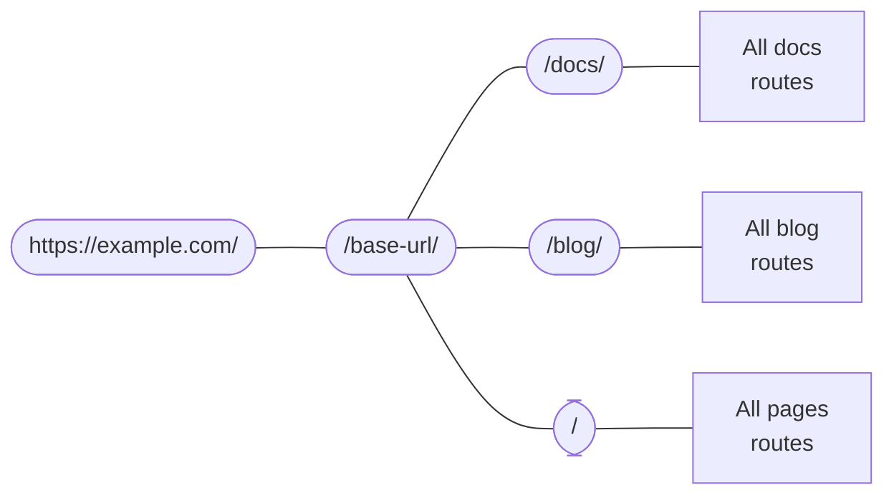

:dog:

```mermaid
graph LR;
    A(["https://example.com/"])
    B(["/base-url/"])
    C(["/docs/"])
    D(["/blog/"])
    E(["/"])
    F["All docs <br/>routes"]
    G["All blog <br/>routes"]
    H["All pages <br/>routes"]
    A---B;
    B---C;
    B---D;
    B---E;
    C---F;
    D---G;
    E---H;
```
