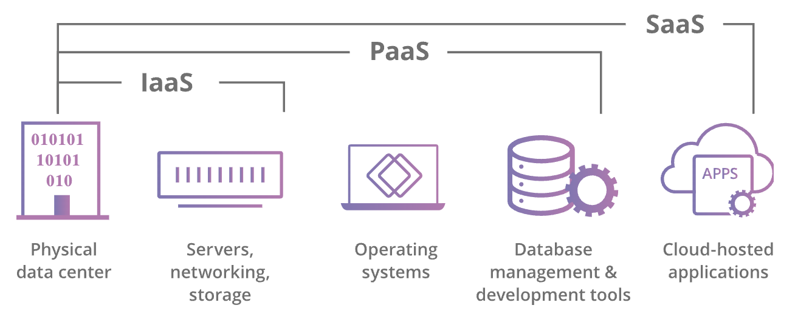

# Serverless

## There is no server?

> There are still servers, silly.

But you delegate the management & maintenance to 3rd parties. Therefore, we use **Platform as a Service** wherever possible, for example:
- CosmosDB, DynamoDB > provisioning own database server
- Auth0, AWS Cognito > for authentication & authorization
- Run custom code on Functions: AWS Lambda/GCP Functions/Azure Functions

3 service models of cloud computing (<a href="https://www.cloudflare.com/learning/serverless/glossary/platform-as-a-service-paas/">source</a>) 

## Functions

On its own, functions **isn't** a serverless framework.

- Easy to run -> good for **experiments & prototyping**.

- **Automate development processes**. *(You don't want to build a server just to handle 1 webhooks integrate with Slack channel for deploy notifications.)*

- **Decompose** or **extend** monolithic applications. Sometimes, you just need to add a couple of functions to existing architecture to get things done.

- **Independent scaling.** Independent services means you can scale it independently as well *(in monolithic architecture, we have to which consider services should be scale together and group it into a server to minimize the cost)*.
- **Adapters** for integrate systems.

