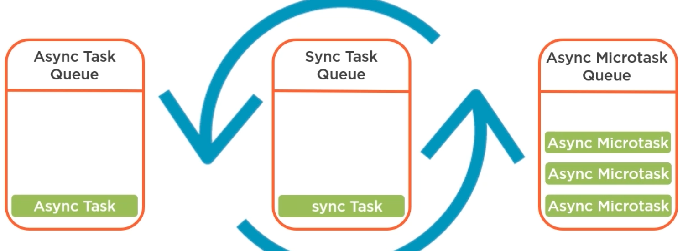

# Concurrency & Async Patterns

## Foundation

### Callbacks

A function that Node will "call back" at a later point in the time of program.

Callbacks help us to write code in a asynchronous way. While the actual thing does the asynchronous works is Node (C++ behind the scene).

### Event Loop

See more [example](/learn/framework/nodejs/2-characteristics.mdx#event-loop).

:::info
Node uses this to process asynchronous actions and interface them for you so that you don't have to deal with threads.

In other languages, you have to manage threads yourself, start them, do async works inside of them, monitor them, make sure they don't access shared data (or they do but make sure no race conditions).
:::

Infinite loop built inside Node. The event loop **synchronously** executes task in the synchronous task queue (also called **call stack**), because JavaScript is single-threaded, so **event loop is "single-threaded"**.



However, since only one thing can execute at a time, long running tasks will block others. So the Node runtime & web browser minimize this by allowing use to execute code asynchronously.

It adds task to async task queue (**async tasks are callback functions**), when event loop executes all items in sync task queue, it will look for tasks in async task queue to execute.

:::note
**Q**: If JavaScript is single-threaded, where are these asynchronous tasks running while the event loop executes other parts?

*A*: The only part that's limited to single thread is your JavaScript code! For example, when you read file with `fs`, under the hood, it's actually calling into code written in C++ that can use multiple threads to perform the work (C++ code bỏ callback vào async queue như hình trên).
:::

To stop it, you can use Linux kill command with process ID or Ctrl + C.

:::info
Don't block event loop.

***The code we write runs in a single thread.*** Therefore, to keep the app responsive, we need to keep the event loop looping and picking up new code to execute.

$\rightarrow$ **write asynchronous code**
:::

### Promises

A mystery thing that someone promises to give you. It might turn into thing you asked for eventually (success), or not (failure) :D

```javascript
// creating
function doAsyncWork(resolve, reject) {
  // perform async calls
  if (success) {
    resolve(data)
  } else {
    reject(reason)
  }
}
let myPromise = new Promise(doAsyncWork);

// calling
myPromise()
  .then(data => console.log(data))
  .catch(error => console.error(error))
  .finally(() => console.log('All done'))
```

### Generators

Specail type of function that can be paused in the middle of execution and resumed at some point in the future:
- it stores the state of the function while paused
- return *generator* objects (which is iterators)

They employ a technique known as **lazy execution**, means values only computed on demand, not doing any unnecessary work. They enable the functionality we get with `async` and `await`.

```javascript
function *generatorFunction() {
  console.log('starts')
  let x = 5
  yield x  // resume here & return x

  x++
  y = yield x  // value assigned to y is whatever pass to the next() to resume execution
  return x + y
}
let iterator = generatorFunction()
console.log(iterator.next())  // prints 'starts', { value: 5, done: false }
console.log(iterator.next())  // { value: 6, done: false }
console.log(iterator.next(4))  // { value: 10, done: true }
```

### `async` / `await`

They're built on top of promises and generators. `async` marks functions that can be paused while it `awaits` the resolution of a promise:
- data returned from async functions is automatically wrapped in a promise.
- `await` can only be added in front of function that returns a promise:
  - it pauses the current async function while it waits for the promise to be resolved
  - it also unwraps the data in the resolved promise for us

It helps you **write asynchronous code that reads more like synchronous code**.

```javascript
// this looks like synchronous
const func = async () => {
  const data = await getData();
  return data;
}

// but it's actually asynchronous
func.then(data => console.log(data))
console.log('END')

// highlight-start
// console
> END
> data ...
// highlight-end
```

## Async Patterns

Node originally used the callback pattern for everything asynchronous. Nowadays, it adopts more patterns, as they surface in the JavaScript itself.

```javascript
// synchronous
const data = fs.readFileSync(__filename);
console.log(data)  // prints first
console.log('HERE')  // prints last

// asynchronous
/**
* this method is asynchronous, it goes through the event loop
* we can't access the data directly after calling this method
* -> Node use callback pattern here
*/
fs.readFile(__filename, function cb(err, data) {
  console.log(data)
})
console.log('HERE') // prints first, because the readFile is async, no blocking

// promise
const readFile = util.promisify(fs.readFile);
async function main() {
  const data = await readFile(__filename)
  console.log(data)
}
main()
console.log('HERE')
```

## Event-driven

Event-driven programming is a style of programming in which the flow of program is at least in part determined by the events that occur as the program executes.

### Event Emitters

A class help you to instantiate an event emitter and then define mutilple callbacks to be invoked when a particular event is emitted: `emitter.emit()`, `emitter.on()`.

```javascript
const EventEmitter = require('events')

const emitter = new EventEmitter()
// you have to register before emit
// listen to event
emitter.on('SOME_EVENT', (msg) => { console.log(msg) })
// at some point we emit event
emitter.emit('SOME_EVENT', 'Hello World!')  // prints Hello World!

setImmediate(() => { ... }) // push the execution of the code into the next cycle of the event loop
```

`EventEmiiter` calls all listerners synchronously in the order in which they were registered.

Below is not a recommended way to code, but at least you know it exists, there are other HOCs build on the `EventEmitters`.

```javascript
const serveCustomer = (customer, done) => {
  // what to do when customer decide
  customer.on('decided', order => {
    order.on('prepared', food => customer.eatAndPay(food))
    cook.prepareFood(order)
  })
  // what to do when customer leave
  customer.on('leaving', tip => done(null, tip))

  // after all the callbacks are registered, we give menu to customer
  customer.placeOrder(menu)
}
```

## Worker Threads

The Node event loop is great at letting you asynchronously offload I/O operations, but the single-threaded nature means no good to deal with long running CPU-intensive tasks.

Worker threads give you APIs to deal with CPU-intensive tasks, it send those types of workloads to another thread while keeping main thread available for a new user request.

Each worker thread instance is really a new instance of the event loop.

:::note
We don't have some tradition mechanisms for **thread synchronization**, but we can pass messages back and forth between main thread and worker thread
:::

```javascript
const { Worker, isMainThread } = require('worker_threads')

if (isMainThread) {
  const firstWorker = new Worker(__filename)
} else {
  const secondWorker = new Worker('cpu_intensive.js')
  const thirdWorker = new Worker(`
    console.log('Do CPU-intensive stuff here')
  `, { eval: true })
}
```

More example

```javascript
const { Worker, isMainThread, parentPort, workerData } = require('worker_threads')

if(isMainThread) {
  console.log('Starting the main thread')
  const worker = new Worker(__filename, {
    workerData: {
      prefix: 'Received message',
      delay: 2000
    }
  })
  // register event handlers for worker thread
  worker.on('message', (msg) => { console.log(`Worker: ${msg}`) })
  worker.postMessage('Done with my work')
  console.log('Still in the main thread')

} else {
  // this only registers, doesn't mean it will run first
  parentPort.on('message', (msg) => { console.log(`${workerData.prefix}: ${msg}`) })

  parentPort.postMessage('Getting started')  // parentPort is communication port back to the main thread
  wasteTime(workerData.delay)  // block the worker thread
  parentPort.postMessage('In the middle')  // it's also an EventEmitter, `message` event
  wasteTime(workerData.delay)
  parentPort.postMessage('All done')
}

function wasteTime(delay) {
  const end = Date.now() + delay
  while(Date.now() < end) { }
}

// highlight-start
> Starting the main thread
> Still in the main thread
> Worker: Getting started
> Worker: In the middle
> Worker: All done
> Received message: Done with my work  // worker event loop is still being blocked by wasteTime call
// highlight-end
```

:::note
This should only be used for CPU-intensive tasks. For I/O bound code, like disk access and network calls, it's more efficient to use the asynchronous APIs.
:::
