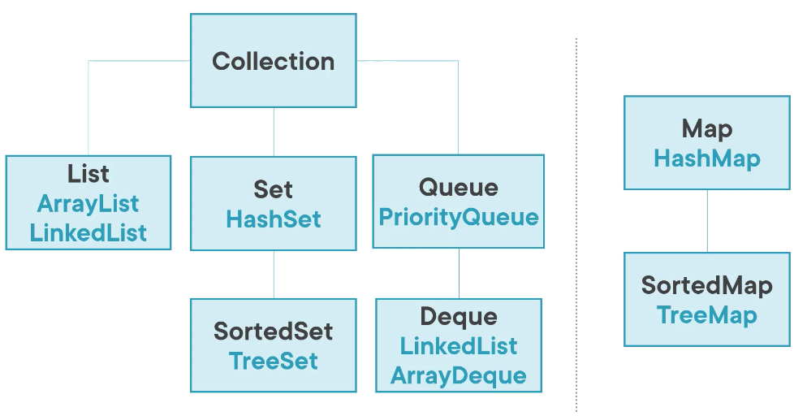
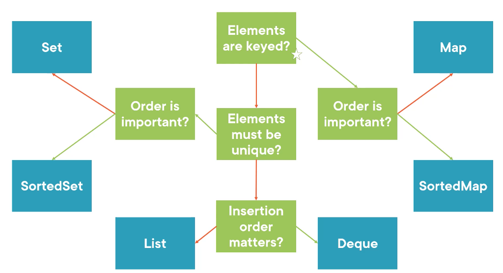

# Collections

## Arrays

Arrays provide an ordered collection of elements. They're **immutable**.

```java
float[] theVals = new float[3];
float[] theVals = { 10.0f, 20.0f, 15.0f };
```

In Java, array variables are references. See more at [References](/learn/language/java/4-data-types.mdx#reference-types) to learn more.

### Problems

```java
private static Product[] add(Product product, Product[] array){
  int length = array.length;
  var newArray = Arrays.copyOf(array, length + 1);
  newArray[length] = product;
  return newArray;
}
var door = new Product("Wooden Door", 35);
var floorPanel = new Product("Floor Panel", 25);
var window = new Product("Glass Window", 10);

// Create
Product[] products = { door, floorPanel };
// 1. Print - horrible format
// highlight
System.out.println(products);
// -highlight
System.out.println(Arrays.toString(products));
// 2. Add - complex code
// -error
products[2] = window;  // array is immutable
// -highlight
products = add(window, products);
// 3. Duplicates - no way
// highlight
products = add(window, products);
```

Array is also **covariant**, which means that if a subtype array can be assigned to a supertype array reference variable:

```java
class Animal {}
class Dog extends Animal {}

public class ArrayCovarianceExample {
  public static void main(String[] args) {
    Dog[] dogs = { new Dog(), new Dog() };
    Animal[] animals = dogs;  // this is allowed in array

    animals[0].toString();
    // -error-start
    // compiler only allows us to call methods in the Animal class
    animals[0].bark();
    // -error-end
    // -highlight-start
    // if you want to call bark(), you have to downcast
    // which is really dangerous
    ((Dog) animals[0]).bark();
    // -highlight-end
  }
}
```

$\rightarrow$ So we'd better not using it. Using generic `List` can prevent this, see [example](/learn/language/java/12-advanced.mdx#working-with-inheritance).
See why we shouldn't downcast [here](/learn/language/java/10-oop.mdx#downcasting--instanceof).

```java
List<Integer> nums = Arrays.asList(1, 2, 3);  // [1, 2, 3]
```

## Collection of Collections

Each collection has more than 2 different components.

| Interfaces                            | Implementation              |
|---------------------------------------|-----------------------------|
| Multiple data structures              | Specific data structures    |
| Functional characteristics (behavior) | Performance characteristics |
| Prefer as **variable type**           | Concrete and instantiable   |
| Often has a popular implementation    |                             |



### What to use?



### Common Behaviors

#### Common Methods
- `size()`
- `isEmpty()`
- `add()`
- `addAll()`: like `add` but for many
- `remove(element)`
- `removeAll(collection)`
- `retainAll(collection)`: retain: giữ lại
- `contains(element)`
- `containsAll(collection)`
- `clear()`

#### Iterator

`Collection` extends `Iterable` (like `Iterator`).

```java
Collection<Product> products = new ArrayList<>();
products.add(door); products.add(floorPanel); products.add(window);

// -error-start
for (var product : products) {
  products.remove(product);   // modification while operation (looping) will crash it
}
// -error-end
// -highlight-start
// removeIf
products.removeIf(product -> product.weight() > 20);
// -highlight-end

// -highlight-start
// use iterator to remove products.
Iterator<Product> iterator = products.iterator();
while (iterator.hasNext()) {
  final Product product = iterator.next();
  if (product.weight() > 20) {
    iterator.remove();
  }
}
// -highlight-end
```

These methods pass in a [lambda expression](learn/language/java/12-advanced.mdx#lambda-expressions-1) that implements some common [functional interface](/learn/language/java/12-advanced.mdx#standard-functional-interfaces).

### Collection Factories (Immutable)

Sometimes, the code allows modifying the view that takes change the backing, which violate [encapsulation](learn/language/java/10-oop.mdx#encapsulation).
$\rightarrow$ these help us to create **unmodifiable, immutable**, empty or wrapping collections. Modification will throw exception.

#### Create Empty Collections

They seem useless, but memory efficient. Use when you want to *pass no values to a method* that takes a collection.

```java
// immutable
List<String> list = Collections.emptyList();
Map<Integer, String> map = Collections.emptyMap();
Set<Integer> set = Collections.emptySet();
```

#### Create Singletons

```java
// immutable
List<String> list = Collections.singletonList("one");
Map<Integer, String> map = Collections.singletonMap(1, "one");
Set<Integer> set = Collections.singletonSet(1);
```

#### Create (Not Empty) Collections

```java
// immutable
List<String> list = List.of("UK", "USA");
Map<String, Integer> map = Map.of("UK", 67, "USA", 328);
// when more than 10 args
Map<String, Integer> entries = Map.ofEntries(
  Map.ofEntries(
    Map.entry("UK", 67),
    Map.entry("US", 328)
));
```

#### Create Copies

```java
var mutableList = new HashMap<>();  // this is mutable
// immutable
var immutableCopy = Map.copyOf(mutableList);  // this is immutable

// modifying mutableList does not modify immutableCopy
mutableCopy.put(key, value);
```

#### Create Views

Views are **unmodifiable**, but they can be read (modify backing list will affect the view).
$\rightarrow$ use when we want to keep mutation within a class.

```java
// -highlight-start
Collections.unmodifiableList(list);
Collections.unmodifiableMap(map);
// -highlight-end

List<String> countries = new ArrayList<>();
countries.add("UK"); countries.add("USA");
// if countries.add("FR"); is also adding to countriesView
List<String> countriesView = Collections.unmodifiableList(countries);
```

- [Static factory methods](#static-factory-methods)
- [Immutable map factories](#immutable-map-factories)

### Collection Operations

Useful collection algorithms.

```java
var products = new ArrayList<Product>();
Collections.addAll(products, door, window, chair);
Collections.rotate(elements, distance); // distance = 1: [a, b, c] -> [c, a, b]
Collections.shuffle(elements, randomGenerator);  // randomly arrange, default use Java.random
Collections.binarySearch(elements, key, Comparator);
Collections.disjoint(a, b);  // true nếu không giao nhau
Collections.frequency(letters, 'A');
Collections.max(elements, comparator);  // min
Collections.fill(list, element);  // replace every element
Collections.swap(elements, 1, 2);  // swap element by index
Collections.reverse(elements);
```

## Lists

List are collections with **iteration order**. Every element in the list has an index.

### Key Features

#### Basic get/set
- `void add(int index, E e)`
- `E get(int index)`
- `E remove(int index)`
- `E set(int index, E element)`
- `boolean addAll(int index, Collection c)`

#### Static Factory Methods

Creates **unmodifiable** List instance
- `List<E> of()`
- `List<E> of(E e1, E e2)`
- `List<E> of (E ... elements)`
- `List<E> copyOf(Collection<E>)`: this is a shallow copy (just copies values)

Overloads for 0-10 arguments. For > 10 args, there's [varargs constructor](/learn/language/java/12-advanced.mdx#varargs).

#### Lookup & Split
- `int indexOf(Object o)`: return `-1` if not found
- `int lastIndexOf(Object o)`
- `List subList(int fromIndex, int toIndex)`: this is a view, modifying the view also modifies the backing list itself

:::info
Modifying a **view** also affects on the backing one.
:::

#### Sorting
Java use TimSort-based algorithm
- `list.sort(Comparator<? Super E> comparator)`: comparator defines sort order

A Comparator is an interface in Java that defines sort order.

```java
// define Comparator
import java.util.Comparator;
public static final Comparator<Product> BY_WEIGHT = Comparator.comparingInt(Product::weight);
/**
implements
public interface Comparator<T> {
  int compare(T o1, T o2);
}
**/
products.sort(Product.BY_WEIGHT);
```

### Implementations

:::cautionAvoid `List` legacy implementations
**avoid** `Vector`, `Stack`, they're synchronized.
:::

#### ArrayList
:::info How it works
There is a *backing array*, where there's many space to add, remove, etc. Most of the time, JDK start with an empty backing array.
When you add first element, it grows to the default initial collection size (10).

Once you run out of 10 elements, it starts to *doubling* in size.
:::

This is good general purpose implementation, use as default. CPU cache sympathetic.

#### LinkedList

Has head nodes and tail nodes, they could be the same and pointer at each of them. `LinkedList` in Java is doubly linked list (có hướng ngược lại).

Most of the time, worse performance. Only good when adding elements at start, adding/remove a lot.

### Performance Comparison

|              | get    | add                                                                                 | contains | remove             | next   |
|--------------|--------|-------------------------------------------------------------------------------------|----------|--------------------|--------|
| `ArrayList`  | $O(1)$ | $O(N)$ doubling strategy, copy & expand the list<br />$\Omega(1)$ with larger array | $O(N)$   | $O(N)$ delete head | $O(1)$ |
| `LinkedList` | $O(N)$ | $O(1)$                                                                              | $O(N)$   | $O(N)$             | $O(1)$ |

## Maps

Maps are collections of **pairs**, like dictionaries. Key -> Value. Key are unique.

Map is better because it helps you not to deal with lookup loop so much. `Map` is the only collections that don't extend or implement the `Collection` interface.

:::info
Java use "map" terms instead of "dictionary", but it's actually a class in JDK & it predates the original Java collection API & kind of deprecated at this time. So **don't use it**.
:::

### Key Features

- `V put(K key, V value)`: return previous value associated with the key, if no, return null
- `void putAll(Map<? extends K, ? extends V> values)`
- `get(Object key)`: if no, return null
- `boolean constainsKey(Object key)`
- `boolean constainsValue(Object value)`
- `V remove(Object key)`
- `void clear()`

**Use Object type rather than K key generic: if you have a local variable that is type of Object and has a string in it, you can use that variable without introducing additional cast to a specific key type*

#### Views

Modify it also modify backing map. All below return a view.

- `var ids = map.keySet();`
- `var values = map.values();`
- `var entries = map.entrySet();`: entry represents a <K, V> pair. We cannot add element to entry set, but we can remove

#### Immutable Map Factories

```java
Map.Entry<String, Integer> entry = Map.entry("Richard", 38);  // individual key/value pairs
Map<String, Integer> personToAge = Map.of("Richard", 38);  // up to 10 value specific overload Factories
personToAge = Map.ofEntries(Map.entry("Richard", 38));  // for > 10 varargs factory takes entry objects
Map<String, Integer> copy = Map.copyOf(personToAge);  // immutable copies of existing Map
```

#### Alter & Remove

- `replace(key, value)`: update single value
- `replaceAll(BiFunction<K, V, V>)`: replace elements using a function `(key, oldValue) -> newValue`
- `remove(key, value)`: remove a key only if it has a value

#### Update

- `getOrDefault(key, defaultValue)`: regular `get` returns null if not found
- `computeIfAbsent(key, function)`: return value if present. If no, execute function `key -> newValue`, then return the new value
- `putIfAbsent`
- `computeIfPresent`
- `compute`
- `merge`

Normally, you have yo use `entrySet`, but you can use `forEach` for more convenient.

### Implementations

`HashMap` allows null keys & values. `TreeMap` allows null values, but not keys.

#### HashMap

Good general purpose implementation.

:::infoHow it works
When put value in hash map, it takes `.hashCode()` of the key.
It takes a bucket of elements behind that
It compute the hash from that key `rehash(hash) % bucket_count`
$\rightarrow$ defines a slot within the backing array

Caveat: hash value itself is passed through rehashing function to reduce probability of hash code collision
Buckets are linked list to accommodate collisions
In Java 8, buckets are converted to trees when there are > 8 elements in the linked list
:::

Implement `obj.equals()` & `obj.hashCode()`. Example:

```java
@Override
public boolean equals(final Object o) {
  if(this == o) return true;
  if(o == null || getClass() != o.getClass()) return false;
  final Animal animal = (Animal) o;
  return Objects.equals(name, animal.name);  // ? name.equals(animal.name);
}
@Override
public int hashCode() { return Objects.hash(name); }  // ? name.hashCode();
```

:::caution
Whatever type used as the keys in `HashMap`, those need to be immutable objects (always return the same value for `hashCode` method).
:::

#### TreeMap

Defines sort order and add functionality

:::infoHow it works
Use red/black tree (a balanced binary tre)
:::

#### Advanced

`EnumMap`, `LinkedHashMap`, `IdentityHashMap`, `WeakHashMap`

### Performance Comparison

|           | put                                                     | get                    | containsKey            | next            |
|-----------|---------------------------------------------------------|------------------------|------------------------|-----------------|
| `HashMap` | $O(N)$ worst case, re-expand hash map <br/> $\Omega(1)$ | $O(N)$<br/>$\Omega(1)$ | $O(N)$<br/>$\Omega(1)$ | $O(Capacity/N)$ |
| `TreeMap` | $O(log(N))$                                             | $O(log(N))$            | $O(log(N))$            | $O(log(N))$     |

## Streams

Alternative to traditional approach of using `forEach` or iterators to operate on collections. Java stream supports **functional-style** programming (see [an example of using stream with no side effect](/learn/language/java/12-advanced.mdx#capturing-local-variables)).

```java
elements.forEach(e -> ...) // side effecting for each
```

**Stream vs. Loops**

| Streams                                        | Loops                              |
|------------------------------------------------|------------------------------------|
| High level construct (less boilerplate)        | Low level construct (more control) |
| Optimized framework                            | Can be faster                      |
| Readability                                    | Readability (depends)              |
| Corner cases (stream doesn't throw exceptions) | Checked Exceptions                 |


Stream operations are divided into 2 types:

| Intermediate                                                       | Terminal                                                   |
|--------------------------------------------------------------------|------------------------------------------------------------|
| Everything but the last, returns `Stream<T>`.<br/> E.g. `filter()` | Last in the Pipeline, returns values.<br/> E.g. `toList()` |

### Intermediate Operations

#### Filter
```java
streamOfElements.filter(e -> e.getSize() > 10);
```

#### Map
```java
streamOfElements.map(Element::getName);  // transform elements from this to that
```

#### Skip & Limit
```java
streamOfElements
  .skip(elementsOnPage * pageNumber)  // discard next N elements
  .limit(elementsOnPage)  // only keep next N elements
```

#### Sorted
```java
// 1. Sort Comparable objects with default order
elements.map(Element::getName).sorted()  // String implements Comparable -> alphabetiaclly sort order

// 2. Sort objects with a specified comparator
Comparator<Element> byName = Comparator.comparing(Element::getName);
elements.sorted(byName)
```

#### FlatMap
```java
// transform elements from one value in to zero, one or many values
// flatMap function recieves a stream of value
// here, we replace streamOfShipments with streamOfProducts
streamOfShipments.flatMap(shipment -> shipment.getLightProducts().stream())

List<Integer> nums = Arrays.asList(1, 2, 3);
nums.stream()
  .map(num -> Arrays.asList(num, num * 2))  // [1, 2], [2, 4], [3, 6]
  .flatMap(Collection::stream)  // [1, 2, 2, 4, 3, 6]
// or
nums.stream()
  .flatMap(num -> Arrays.asList(num, num * 2).stream())
```

### Terminal Operations

#### toList
```java
elementStream.toList();  // create a List, it is unmodifiable

// Object[]
elementStream.toArray();  // create objects array

// Element[]
elementStream.toArray(Element[]::new);  // pass a function to create specific array type
```

*Note, `toList` is introduced in Java 16. If you're using Java 8, you can use [collectors](#collectors): `collect(Collectors.toList())`*

#### Match
```java
// these all returns a boolean
// if any/none/all elements match a predicate
elements.anyMatch( e -> e.getWeight() > 20 );

elements.noneMatch( e -> e.getWeight() > 20 );

elements.allMatch( e -> e.getWeight() > 20 );
```

#### Find
```java
// max/min element given a sort order
elements.max(Comparator.comparingInt(Element::getSize))

// findFirst (or findAny()) get the element
elements.filter(...).findFirst()

// count number of elements in a stream
elements.filter(...).count()
```

#### Reduce
```java
// combine elements together using a combining function & an accumulator
elements.reduce(0, (accumlate, e) -> accumlate + e.getSize())
```

### Collectors

Collectors are operations that happen at the end of Streams, so they are terminal operations.

```java
elements.stream().filter(...).sorted(...)
  .collect(Collectors.toList());
  // add static import so we don't need `Collectors.` part
  .collect(groupingBy(Element:getName));
  /**
  this is called downstream collectors
  counting() is like count() but it takes elements passed by groupingBy()
  this count each group elements
  result is converted from string (return type of groupingBy) to long (return type of counting)
  **/
  .collect(groupingBy(Element:getName), counting()));  // Collectors.groupingBy, Collectors.counting

```

### Implementations

[Boxed numeric is much larger & slower than primitives](/learn/language/java/11-wrapper-classes.mdx#implementation). Java provides streams with primitives.

#### Primitive Streams

Improve performance over boxed numeric streams. Functionality like `sum()` for primitives. Only specialized for 3 primitives: `int`, `long`, `double`

```java
strings.mapToInt(String::length)  // return string stream
IntStream.of(1, 2)
IntStream.range(start, end)
```

#### Parallel Streams

Streams can be run in parallel mode. Run on the common fork-join pool of the JVM. Potentially, but not always, a performance improvement.

```java
collection.parallelStream()
stream.parallel()
```

## Sets

Collection with **uniqueness**, no duplicates.

### Key Features

### Equality Contract

`hashCode` and `equals`. This is 1-way implication, means 2 different objects can have the same `hashCode`, but if they are the same object, they must have the same `hashCode`.

```bash
object.equals(other) -> object.hashCode() == other.hashCode()
```

```java
Arrays.hashCode()
Long.hashCode(longValue)  // Java 8+
// old
(int) (l ^ (l >>> 32 ))
Float.floatToIntBits(f);  // because hash code is a 32-bit integer
Objects.hash()  // Java 7+
```

### Implementations

#### HashSet

Based upon `HashMap`, use `hashCode` and looks up location, good for general.

#### TreeSet

Based upon `TreeMap` (red/black binary tree with defined sort order). Provide extra features:
- `SortedSet`
- `NavigableSet`

#### SortedSet

Defines an order, no indexes, but subset views possible. It extends `Set` interface.

```java
E first();
E last();

SortedSet tailSet(E fromElement);
SortedSet headSet(E toElement);
SortedSet subSet(E fromElement, E toElement);
```

#### NavigableSet

Extends `SortedSet`, provides ways to move through the order, implemented by `TreeSet`.

```java
E lower(E e);
E higher(E e);

E floor(E e);
E ceiling(E e);

E pollFirst();
E pollLast();
```

#### LinkedHashSet

- When to use: copying Set to modify, deduping List or Queue.
- Maintains order: only insertion
- Overhead: Slower than `HashSet`, less memory than `TreeSet`

#### EnumSet

- Keys are Enums: faster and low memory usage
- Bitset implementation: only a single long if < 64 elements

### Performance Comparison

|           | add              | contains              | next            |
|-----------|------------------|-----------------------|-----------------|
| `HashSet` | $O(N) \Omega(1)$ | $O(log(N)) \Omega(1)$ | $O(Capacity/N)$ |
| `TreeSet` | $O(log(N))$      | $O(log(N))$           | $O(log(N))$     |

