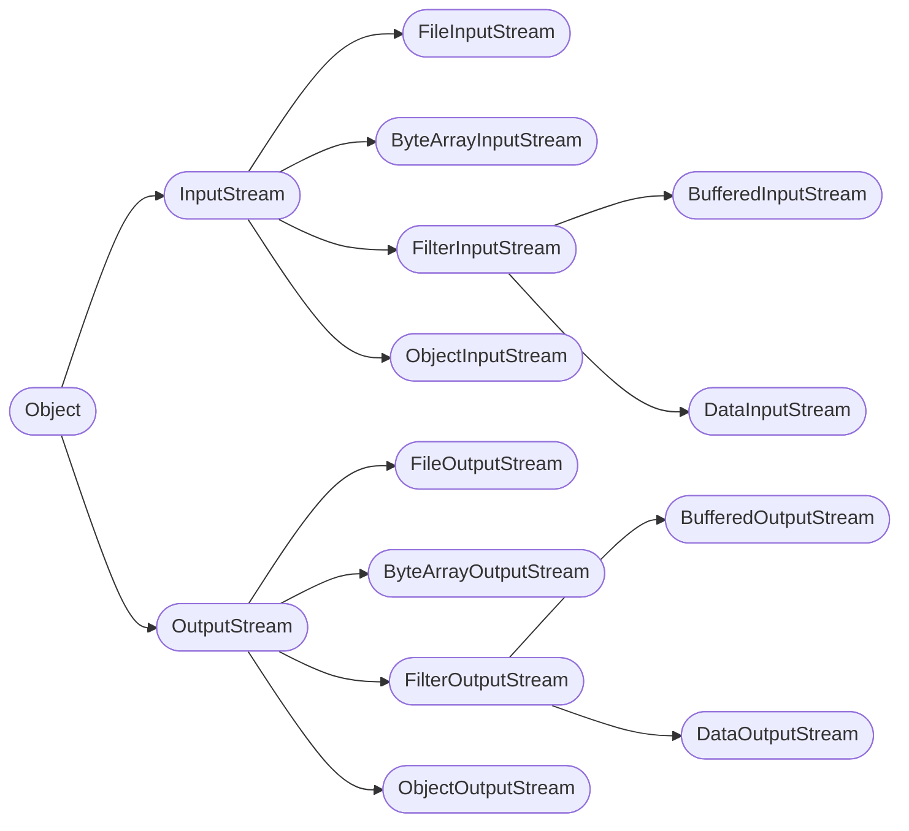

# Classes and Objects

Java is an object-oriented language.

## Objects

In Java, **everything is an object**. It is the root of Java class hierarchy.

*For example, look at the below image, it is hierarchy of classes to deal with input, output stream, it has the root of `Object` class.*



Object has some characteristics:
- an `Object` reference can reference an instance of any class
- **every class** has characteristics of `Object`

```java
Object[] stuff = new Object[3];

stuff[0] = new Student(123);
stuff[1] = new MathEquation();
stuff[2] = "a string";

Object o = "string";
o = new House(1);

void doWork(Object o) { }
```

### Memory

When create object, Java allocates it in **heap** memory. But not only that, Java returns a reference to the object (object's address). And usually, we assign that to a variable.

So unlike [Primitives](/learn/language/java/4-data-types.mdx#primitive-types) (contain a value), Object variables contain a reference to the object.

We never interact with the object directly but through reference.

### Object Class Methods

| Method      | Description                                                       |
|-------------|-------------------------------------------------------------------|
| `clone`     | Create a new object instance that duplicates the current instance |
| `hashCode`  | Get a hash code for current instance                              |
| `getClass`  | Return type information for the current instance                  |
| `finialize` | Handle special resource cleanup scenarios                         |
| `toString`  | Return a string value representing the current instance           |
| `equals`    | Compare another object to the current instance for equality       |

One application of this is to build `equals` method:

```java
public class Person {
  private int age;

  public boolean equals(Object o) {
    Person person = (Person) o;
    return age == person.age;
  }
}
```

But if we use `equals` with classes that aren't `Person`, it can crash the program. To prevent that, use `instanceof`:

```java
public class Person {
  private int age;
  public boolean equals(Object o) {
    // -highlight-start
    if (!(o instanceof Person))
      return false;
    // -highlight-end
    Person person = (Person) o;
    return age == person.age;
  }
}
```

## Classes

Class is a template for creating objects. While object is an instance of a class.

Classes are reference types, means class variable simply hold a reference.

```java
Student tu = new Student();  // age: 0
Student huy = new Student();  // age: 0
tu.age += 10;

// this is reference type (because both tu and huy are not primitive types)
// both variables can reference to the same instance
huy = tu;

huy.age // 10
huy.age += 2
tu.age // 12
```

### Declare

Class has fields & methods.

```java
// Name.java  //  same name of class
class Name {
  int attribute;
  Name() {  // constructor
    atrribute = 0;
  }
  void Method() {}
}
```

Final fields need to be initialized when create objects.

```java
// this will get error from compiler
class Person {
  // -error
  final int age;
  Person() { }  // to fix, we need to init it in constructor
}
```

### Usage

Declare a variable of type of the class doesn't create the object, it just holds the reference.

To create object, use `new` keyword.

```java
Student huytu = new Student();

// it's actually doing 2 step
Student huytu;  // create variable hold the reference
huytu = new Student(); // create new object instance & reference
```

## Access Modifier

**Access modifier** is used to achieve **encapsulation**. It controls class/member visibility.

| Modifier           | Visibility                                                    | Usable on Classes | Usable on Members |
|--------------------|---------------------------------------------------------------|-------------------|-------------------|
| No access modifier | Only within its own package (aslo called **package private**) | ✅                | ✅                |
| `public`           | Everywhere                                                    | ✅                | ✅                |
| `private`          | Only within the declaring class                               | ❌*               | ❌                |
| `protected`        | Only within its package and all subclasses    |||

**In general, classes cannot be `private`. There is an exception, that is [nested classes](#nested-classes)*.

## Non-access Modifier

- `static`
- `final`
- `abstract`
- `strictfp`
- `synchronized`

### Static Members

This is the least objec-oriented feature of Java. Static members are shared class-wide.
$\rightarrow$ not associated with individual instance.

Using `static` keyword $\rightarrow$ accessible using class name.

*This is why the class has default static `main`, we can call them directly without creating object of that class.*

```java
public class Program {
    public static void main(String[] args) {
      System.out.println("Hello, world!");
    }
}
// highlight-start
JVM call: Program.main(new String[] {});
// highlight-end
```

#### Static Fields

A value not associated to any instance. All instances access the same value.

Global variables are easier to cause bugs $\rightarrow$ better prefer global constant (`public static final` > `public static`)

#### Static Methods

Performs an action not tied to a specific instance. Has access to static members only.

```java
public class Flight {
  private int passengers, seats = 150;
  private static int allPassengers;

  public static int getAllPassengers() {
    return allPassengers;
  }
  public static void resetAllPassengers() {
    allPassengers = 0;
  }
  public void add1Passenger() {
    passsenger += 1;
    allPassengers += 1;
  }
}
```

Usage:

```java
Flight.resetAllPassengers();  // allPassengers: 0

Flight a = new Flight();
a.add1Passenger();  // allPassengers: 1
Flight b = new Flight();
b.add1Passenger();  // allPassengers: 2

Flight.getAllPassengers();  // 2
```

**Limitation**
- You cannot call static method in non-static method $\rightarrow$ you have to create object first
- You cannot override static method.

#### Static Import Statement

Import statement allows a type name to be used without being package-qualified.

Static import statement is used with static methods and allows method name to be used without being class-qualified.

The code above will become like this:
```java
import static java.lang.Math.PI;
import static com.example.flightapp.Flight.resetAllPassenger;
import static com.example.flightapp.Flight.getAllPassengers;
import static com.example.flightapp.Flight.*;  // import all

// -error
double a = Math.PI;
// -highlight
double a = PI;
// -error
Flight.resetAllPassengers();
// -highlight
resetAllPassengers();
// -error
Flight.getAllPassengers();
// -highlight
getAllPassengers();
```

#### Static Initialization Blocks

*Read more about [Initialization Blocks](/learn/language/java/7-functions-methods.mdx#initialization-blocks)*.

It performs one-time type initialization:
- execute before type's first use
- has access to static members only

```java
public class Flight {
  private static int allPassengers, maxPassengers;
  // -highlight-start
  // called once the first time you use the class
  static {
    allPassengers = loadFromFile();
  }
  // -highlight-end
}
```

## Nested Classes

```java
class Outer {
   int num;
   // inner class
   private class Inner {
      public void print() {
         System.out.println("This is an inner class");
      }
   }
   // Accessing he inner class from the method within
   void display_Inner() {
      Inner inner = new Inner();
      inner.print();
   }
}

public class Main {
   public static void main(String args[]) {
      Outer outer = new Outer();  // outer first
      Outer.Inner inner = outer.new Inner();  // then inner
      outer.display_Inner();
      inner.print();
   }
}
```

A static inner class is a nested class which is a static member of the outer class. It can be accessed without instantiating the outer class, using other static members.
